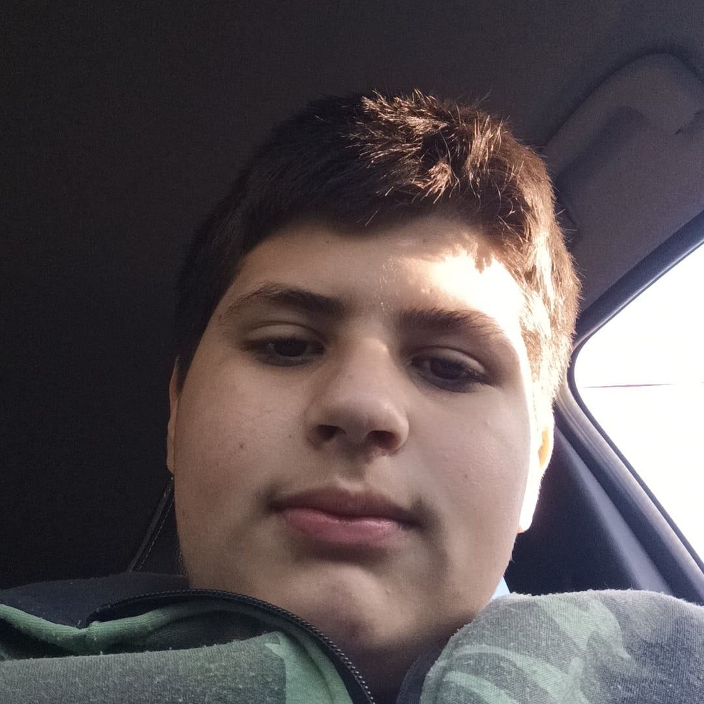

   <h1>Hi! I'm Pitu</h1>
   
     
   <h2>About me: </h2>
   
I'm a PHP and JavaScript developer, I'm still learning how to create websites among other things, but I'm experienced in  PocketMine-MP plugins.

     
   <h2>Languanges and tools: <h2>
   
   <h2>Connect with me:</h2>
   

      
      
      
   

   <h2>Github stats:</h2>
   <p'>
      

      

      
   

